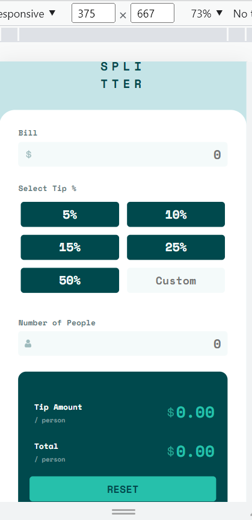
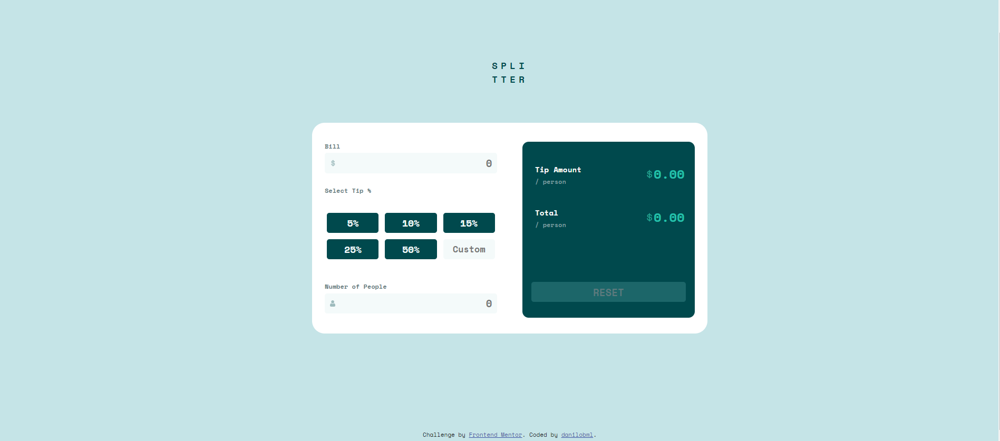
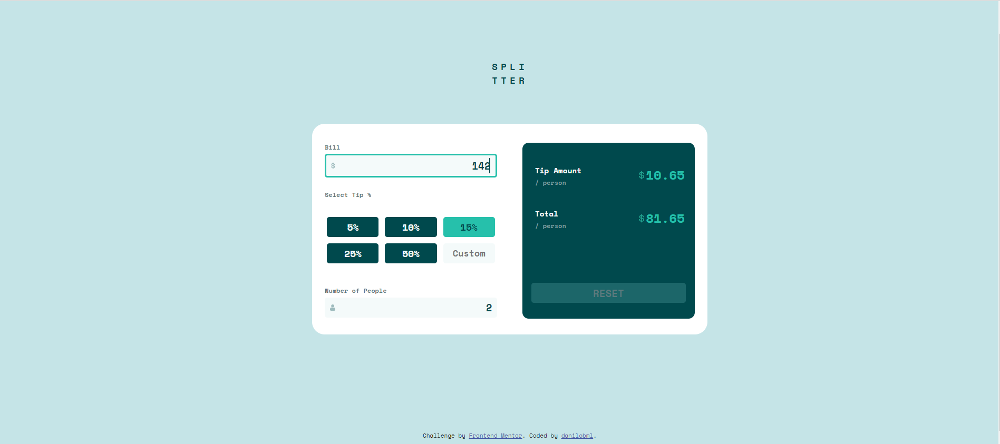
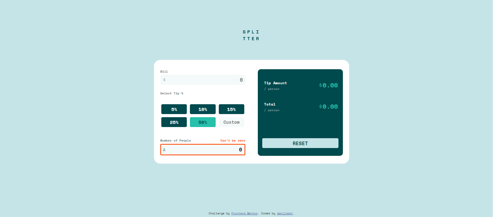

# Frontend Mentor - Tip calculator app solution

This is a solution to the [Tip calculator app challenge on Frontend Mentor](https://www.frontendmentor.io/challenges/tip-calculator-app-ugJNGbJUX). Frontend Mentor challenges help you improve your coding skills by building realistic projects.

## Table of contents

- [Overview](#overview)
  - [The challenge](#the-challenge)
  - [Screenshot](#screenshot)
  - [Links](#links)
- [My process](#my-process)
  - [Built with](#built-with)
  - [What I learned](#what-i-learned)
  - [Continued development](#continued-development)
  - [Useful resources](#useful-resources)
- [Author](#author)
- [Acknowledgments](#acknowledgments)

**Note: Delete this note and update the table of contents based on what sections you keep.**

## Overview

### The challenge

This is my solution to the challenge. I'm learning HTML/CSS/JavaScript development. I'd really appreciate if anyone could review it and give me tips (especially in the Javascript parts), in how to do things better, perhaps in a simpler way. I love to learn, and I'm always open to feedback!

### Screenshots

**Note: Delete this note and the paragraphs above when you add your screenshot. If you prefer not to add a screenshot, feel free to remove this entire section.**

### Links

- Solution URL: [Add solution URL here]()
- Live Site URL: [Add live site URL here](https://danilobml.github.io/fem-tip-calculator/)

## My process

### Built with

- Semantic HTML5 markup
- CSS custom properties
- Flexbox
- Mobile-first workflow
- JavaScript

### What I learned

This was a bit challenging. I am learning React and decided to go back to "vanilla" JavaScript for this project. I sense that I need to practice it much more, in order to get both ways of doing things solifdified, and I might have "overcomplicated" some things in the code. Sizing is also challenging for me. I'd appreciate any feedback or tips to improve.

### Continued development

I need to practice more styling, sizing and vanilla JS.

**Note: Delete this note and the content within this section and replace with your own plans for continued development.**

### Useful resources

- [Stackovewflow](https://stackoverflow.com/) - It was my way out of being stuck so many times...

## Author

- Website - [danilobml](https://github.com/danilobml)
- Frontend Mentor - [@danilobml](https://www.frontendmentor.io/profile/danilobml)

## Acknowledgments

I want to thank my teacher Ben at WBS Coding School for so many things I've learned and the incentive to keep doing it.
